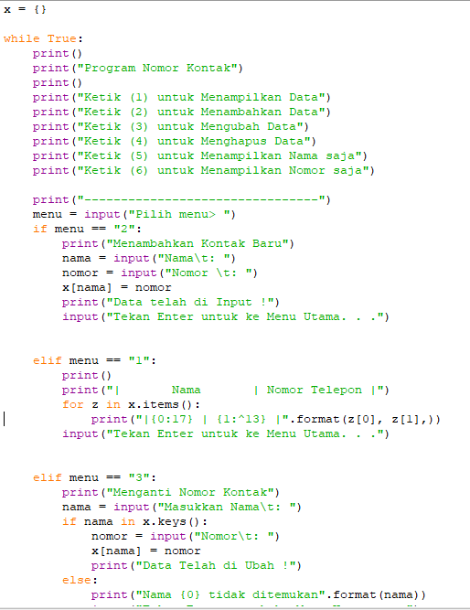
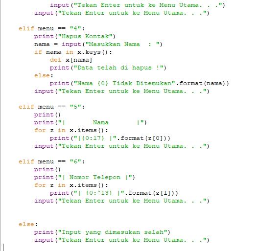
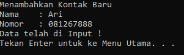
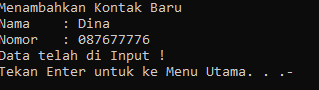
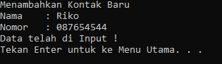
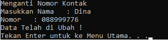
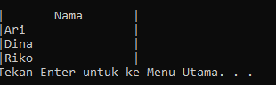
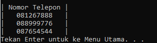
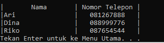

# LatihanP10

Dibawah ini adalah code saya\

Pertama saya menambahkan data kontak Ari dan Dina.\

Menambahkan data kontak baru Riko.\

Mengganti nomor kontak Dina dengan nomor baru.\

Menampilkan semua nama kontak.\

Menampilkan semua nomor telepon.\

Menampilkan semua Data.\
